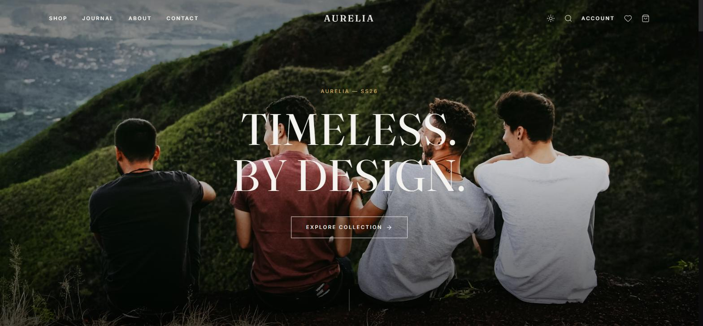
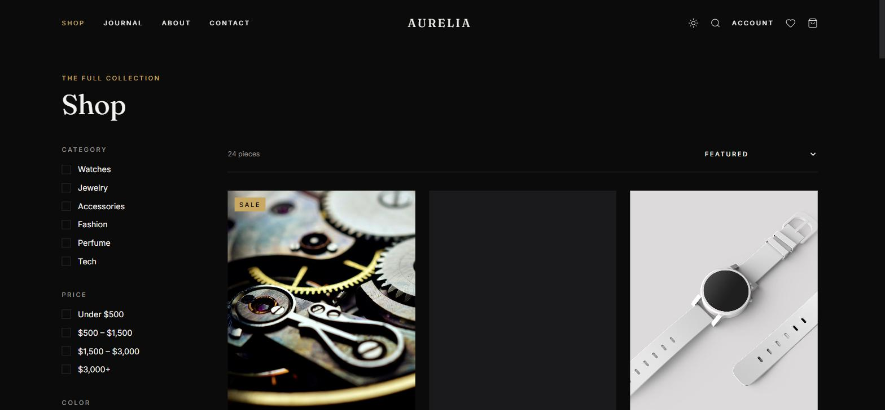
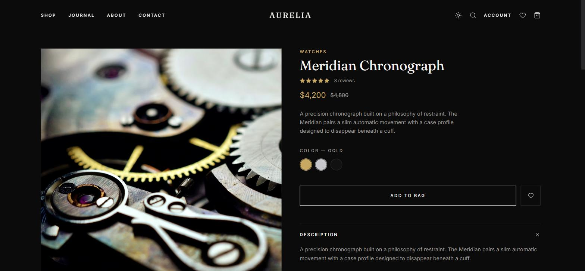
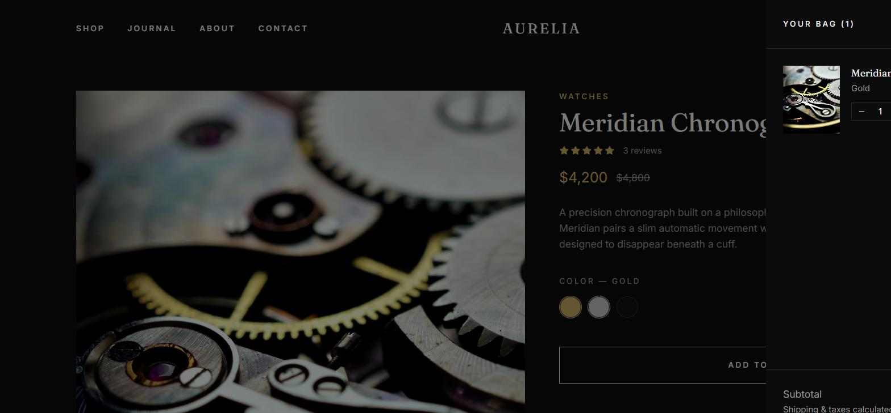
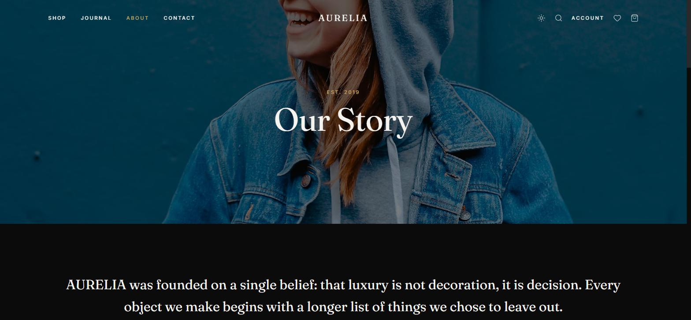
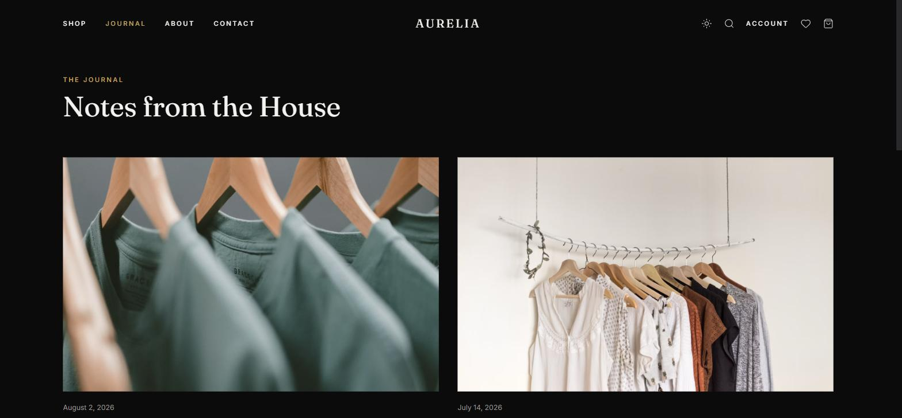

# AURELIA — Luxury E-Commerce React Template

A complete, production-ready luxury e-commerce storefront template. Dark-luxury design system with a light-mode variant, 13 fully built routes, and every product/lifestyle image visually verified to be free of real brand logos or trademarks — safe to reskin and resell.

**[Live demo](https://aurelia-template-phi.vercel.app)** · **[Buy on Gumroad — $49](https://muadme.gumroad.com/l/zimpb)**








## Stack

React 18 · TypeScript · Vite · Tailwind CSS v4 · Framer Motion · Zustand · React Router v6 · React Hook Form · Zod

## Features

- 13 routes: Home, Shop, Collection, Product Detail, Search, Cart, Wishlist, Checkout, About, Journal (index + article), Contact, Account
- Dark-luxury design system with a light-mode variant, Tailwind v4 CSS-variable tokens, Fraunces + Inter type pairing
- Framer Motion scroll reveals, page transitions, drawer/modal animations
- Cart, wishlist, and UI state via Zustand with localStorage persistence
- Multi-step checkout built with React Hook Form + Zod validation
- Product filtering and sorting synced to the URL via React Router query params
- Route-based code-splitting for a lean production bundle
- 24 mock products across 6 categories, fully wired to filters, related items, and reviews

## Getting started

```bash
npm install
npm run dev      # start dev server
npm run build    # production build
```

No backend included — all data is local mock data in `src/data/`, ready to be wired up to your own API or CMS.
