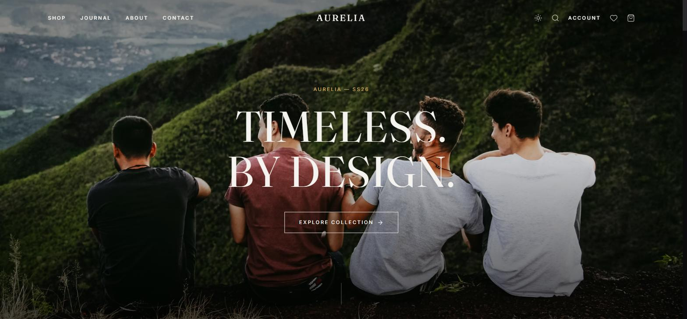
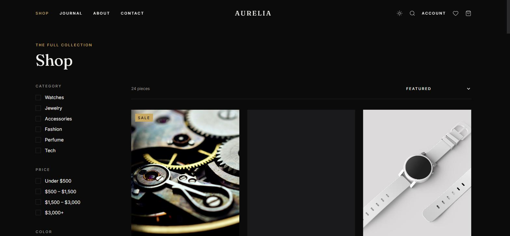
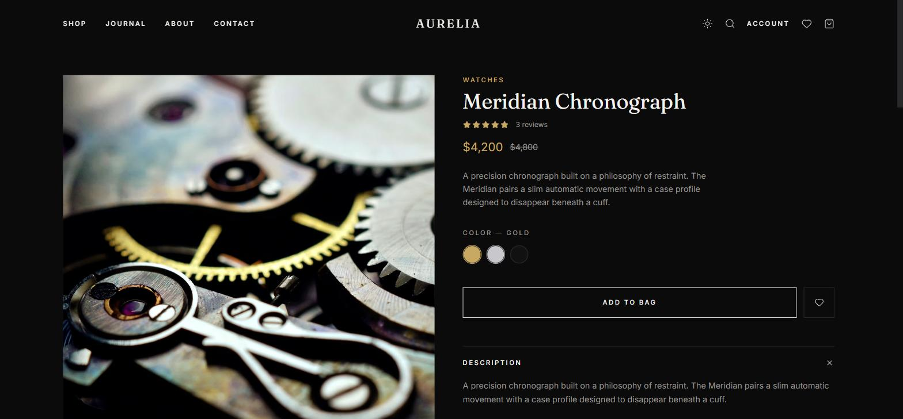
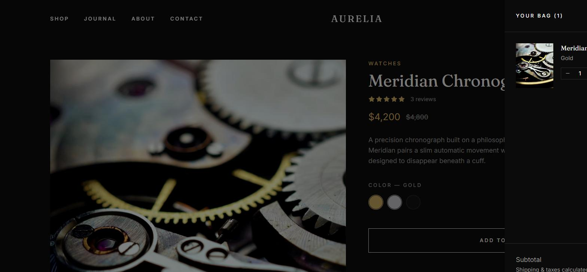
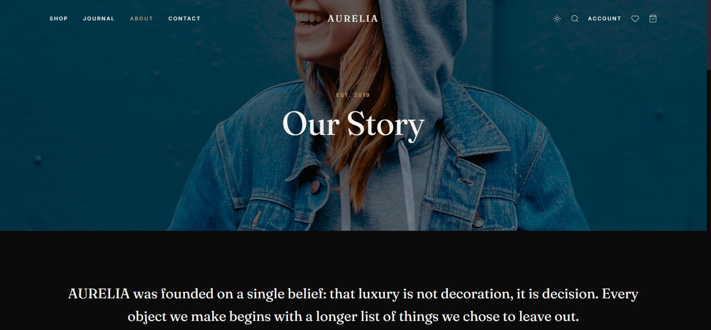
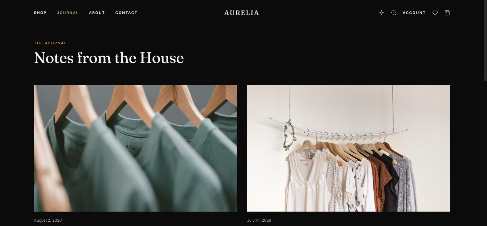

# AURELIA — Luxury E-Commerce React Template

A complete, production-ready luxury e-commerce storefront template. Dark-luxury design system with a light-mode variant, 13 fully built routes, and every product/lifestyle image visually verified to be free of real brand logos or trademarks — safe to reskin and resell.

**[Live demo](https://aurelia-template-phi.vercel.app)** · **[Buy on Gumroad — $49](https://muadme.gumroad.com/l/zimpb)**








## Stack

React 19 · TypeScript · Vite · Tailwind CSS v4 · Framer Motion · Zustand · React Router v7 · React Hook Form · Zod

## Features

- 13 routes: Home, Shop, Collection, Product Detail, Search, Cart, Wishlist, Checkout, About, Journal (index + article), Contact, Account
- Dark-luxury design system with a light-mode variant, Tailwind v4 CSS-variable tokens, Fraunces + Inter type pairing
- Framer Motion scroll reveals, page transitions, drawer/modal animations
- Cart, wishlist, and UI state via Zustand with localStorage persistence
- Multi-step checkout built with React Hook Form + Zod validation
- Product filtering and sorting synced to the URL via React Router query params
- Route-based code-splitting for a lean production bundle
- 24 mock products across 6 categories, fully wired to filters, related items, and reviews

## Getting started

Requires **Node.js 20.19+ or 22.12+** (Vite 8's minimum; older versions fail at install or build).

```bash
npm install
npm run dev      # start dev server
npm run build    # type-check + production build
npm run preview  # serve the production build locally
npm run lint     # lint with oxlint
```

No backend included — all data is local mock data in `src/data/`, ready to be wired up to your own API or CMS.

## Project structure

```
src/
├── components/
│   ├── layout/   # Navbar, Footer, CartDrawer, QuickViewModal, ScrollToTop
│   ├── motion/   # PageTransition, Reveal
│   └── ui/       # Accordion, Container, EmptyState, FilterSidebar, ProductCard, StarRating
├── data/         # products, journal, types, image sources (all local mock data)
├── lib/          # checkout schemas, price formatting, URL-synced filters, theme sync
├── pages/        # one file per route (Home, Shop, Collection, Product, Cart, Checkout, ...)
└── store/        # Zustand stores: cart, wishlist, auth, ui
```

## More templates

- [PROOF](https://github.com/Muaddd1/PROOF) — AI performance and outcome SaaS template with AI task replays, missions, a transparent ROI center and an approval center ([demo](https://proof-muad1.vercel.app))
- [SYNTRA](https://github.com/Muaddd1/SYNTRA) — AI business command center SaaS template with an AI command palette, an approval queue with audit log, a visual workflow builder and five AI agents ([demo](https://syntra-muad1.vercel.app))
- [VANTA DETAIL](https://github.com/Muaddd1/VANTA-DETAIL) — automotive detailing template with a scroll-driven 3D car, a live quote builder and a seven-step booking flow ([demo](https://vanta-detail-muad1.vercel.app))
- [NEXFORM](https://github.com/Muaddd1/NEXFORM) — futuristic personal-trainer template with a 3D athlete, a quiz, a body map and a real booking flow ([demo](https://nexform-muad1.vercel.app))
- [FADEHOUSE](https://github.com/Muaddd1/FADEHOUSE) — premium barbershop template with a real booking flow and a 3D clipper built in code ([demo](https://fadehouse-muad1.vercel.app))
- [ÉLORA](https://github.com/Muaddd1/ELORA) — luxury beauty salon template with a real booking flow and a 3D serum bottle ([demo](https://elora-muad1.vercel.app))
- [VELLUTO](https://github.com/Muaddd1/VELLUTO) — cinematic 3D coffee-brand template ([demo](https://velluto-muad1.vercel.app))
- [AURUM](https://github.com/Muaddd1/AURUM) — luxury gold jewelry template with a live gold price calculator and Arabic RTL ([demo](https://aurum-template-muad1.vercel.app))
- [VANTA](https://github.com/Muaddd1/VANTA) — premium digital-product storefront ([demo](https://vanta-creator-os.vercel.app))
- [GOLDEN CRUST](https://github.com/Muaddd1/GOLDEN-CRUST) — pizza restaurant template with a 3D pizza hero ([demo](https://golden-crust-muad1.vercel.app))
- [PLINTH](https://github.com/Muaddd1/PLINTH) — interior design studio template in a single HTML file ([demo](https://plinth-template.vercel.app))

## Author

Built by [Mouad Sehli](https://muad-portfolio.vercel.app), freelance front-end developer (React, TypeScript, Tailwind). More work and contact details are on the [portfolio](https://muad-portfolio.vercel.app).
